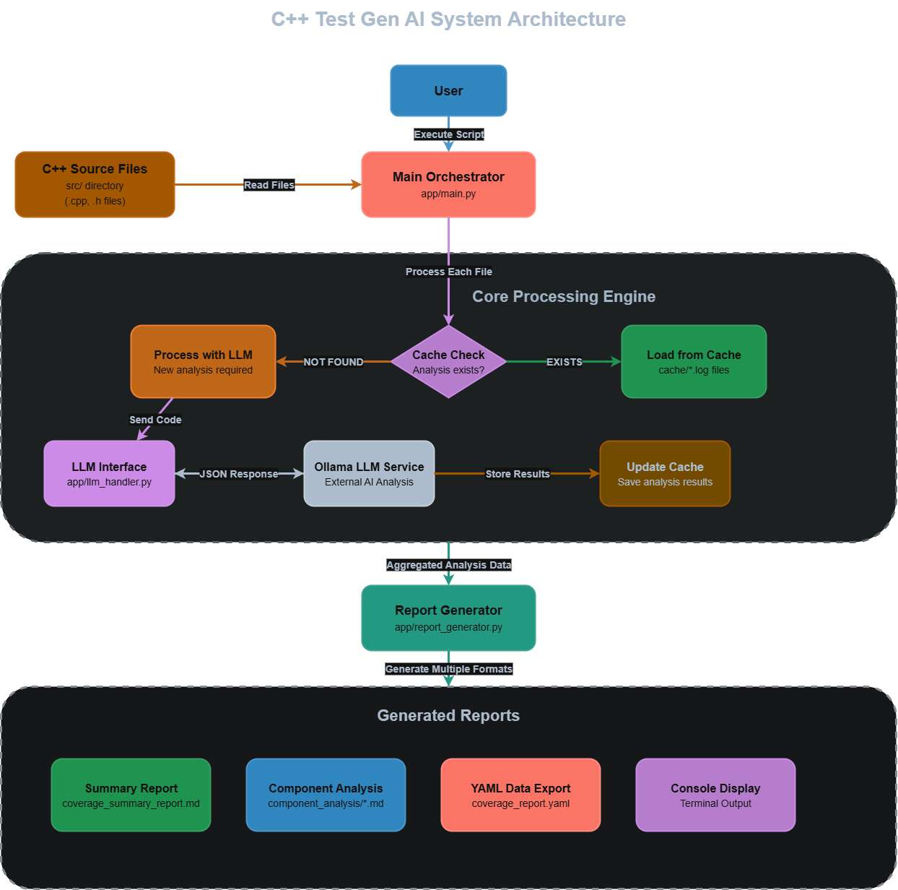

# AUTO TEST CPP

 smart, static analysis tool for C++ projects that uses AI to automatically generate test scenarios and predict code coverage—**without compiling or running any tests**. It’s designed for developers who want deep insights into their codebase using nothing but source files and a local LLM setup.

---

## 🔍 What It Does

- Scans all `.cpp`, `.cc`, and `.h` files in the `src/` directory.
- Sends each file to an AI model (via Ollama using CodeLlama 7B) for expert-level static analysis.
- Predicts potential test cases and code coverage **without any runtime execution**.
- Stores and reuses analysis using a file-based caching system.
- Generates detailed test reports in Markdown, YAML, and terminal formats.

No compilers. No linkers. No build steps. Just smart analysis.

---

## 🧠 System Architecture

The system follows a modular, efficient, and build-free pipeline:

1. **Initialization**
   Run `python -m app.main` to start the analysis workflow.

2. **Source Scanning**
   The tool looks inside the `src/` folder (excluding third-party libraries) to find all relevant C++ files.

3. **Cache-First Workflow**

   - If a file’s analysis exists in `cache/`, it’s reused.
   - Otherwise, the file is sent to the AI model with a structured YAML prompt (`generate_coverage_report.yaml`).

4. **AI Analysis**
   The LLM returns structured JSON containing predicted coverage and test suggestions, which gets cached immediately.

5. **Reporting**
   - A beautiful Markdown summary is created in `reports/`.
   - A machine-readable `coverage_report.yaml` is generated.
   - A terminal summary is printed with key stats.

## 📋 Features

- ⚡ **No Build Required** – Purely static analysis, no compilation or test execution.
- 🧠 **AI-Powered** – Uses `CodeLlama 7B` model via [Ollama](https://ollama.ai).
- 📁 **Per-File Caching** – Avoid reanalysis of unchanged files.
- 📊 **Multi-Format Reports** – Outputs Markdown, YAML, and terminal summaries.
- 🔧 **Configurable & Extensible** – Easy model swapping and modular design.

---

## 📈 Performance Optimizations

- 🔁 **Incremental Analysis** – Only reprocesses changed files.
- 📦 **Granular Caching** – One cache file per source.
- 🧩 **Persistent Model Server** – Ollama stays running for quick reuse.

---

## ⚠️ Limitations

- 🧪 **No Actual Test Execution** – This is static analysis only.
- 🤖 **LLM Dependent** – Output quality may vary by model.
- 💾 **Large Files May Hit Token Limits** – Especially in LLM input context.

---

